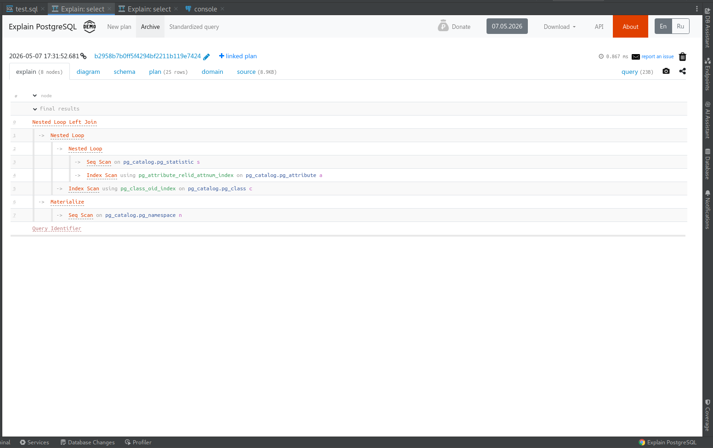
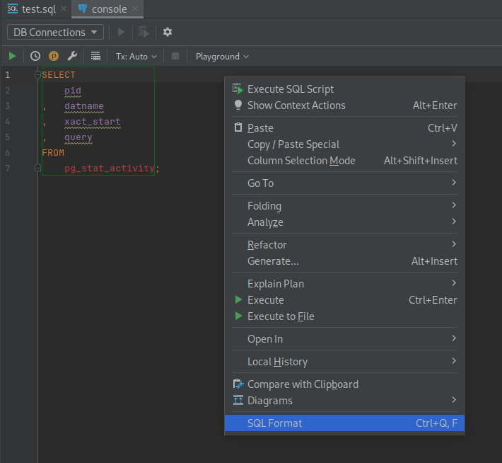

<h3>Explain PostgreSQL IntelliJ plugin</h3>
Analyzes EXPLAIN plan from PostgreSQL and related (Greenplum, Citus, TimescaleDB, Amazon RedShift).
  
Shows plan and node details and visualizations with piechart, flowchart and tilemap, also gives smart recommendations to improve query.
  
<a href="https://explain.tensor.ru/about">Learn more</a>
    
  Usage:
   <ul>
    <li><b>Run query and analyze plan</b> 
      <ul>
        <li><b>IntelliJ Ultimate:</b> right-click the query in Database Console and choose "Explain Plan | Explain Analyze (Tensor)"
           (Webstorm requires installation of Database Tools and SQL plugin)
          
          Explain Analyze results:
          
          Explain results:          
          
        </li>
        <li><b>IntelliJ Community:</b> requires <a href="https://plugins.jetbrains.com/plugin/1800-database-navigator">Database Navigator (DBN)</a> plugin. Then you can either right-click the query in the editor and select "Explain Analyze (Tensor)", or use the corresponding action on the DBN toolbar.</li>
        
        
        
      </ul>
    </li>
    <li><b>Format query</b> – right-click the current query and in context menu choose "SQL Format" or press "Ctrl+Q F"
      (uses the public api from https://explain.tensor.ru , the site can be changed in Settings | Tools | Explain PostgreSQL)
          
    </li>
    <li><b>Plan analyze manually</b> – open "Explain PostgreSQL" tool window and paste the plan from any source
      
    </li>
   </ul>
   
  <a href="https://n.sbis.ru/explain">Support</a>
